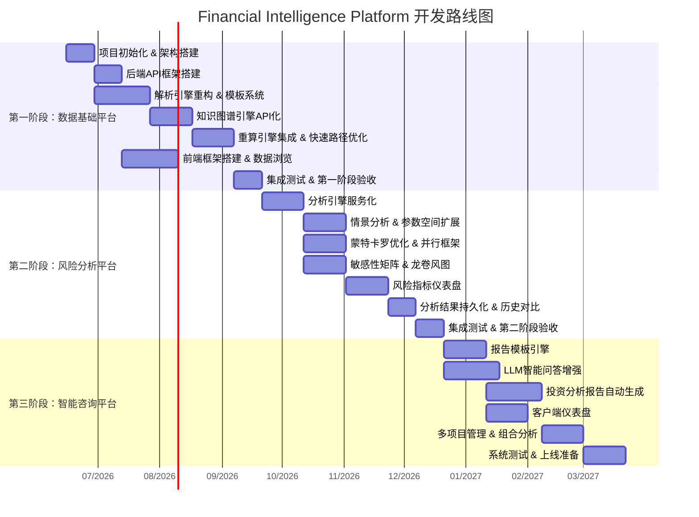

# Financial Intelligence Platform — 项目开发路线图

> 版本: v1.0 | 日期: 2026-06-01 | 状态: 规划阶段

---

## 1. 阶段总览

### 1.1 三阶段时间线



### 1.2 阶段交付物

| 阶段 | 核心交付物 | 业务价值 |
|------|-----------|---------|
| **第一阶段** | 可上传Excel → 自动解析 → 查看数据 → 修改参数 → 重算 | 替代手工Excel，建立数字化数据基础 |
| **第二阶段** | 多维风险分析 → 可视化仪表盘 → 历史对比 | 量化风险，支持科学决策 |
| **第三阶段** | 专业报告 → 智能问答 → 投资建议 | 从工具升级为咨询服务 |

---

## 2. 团队配置

### 2.1 团队结构

```
                    ┌─────────────────┐
                    │   技术负责人(1)   │
                    │  架构/技术决策    │
                    └────────┬────────┘
                             │
        ┌────────────┬───────┴───────┬────────────┐
        │            │               │            │
   ┌────┴────┐ ┌────┴────┐   ┌─────┴────┐ ┌────┴────┐
   │后端组(3) │ │前端组(2) │   │数据组(1) │ │测试组(1)│
   └─────────┘ └─────────┘   └──────────┘ └─────────┘
```

### 2.2 角色与职责

| 角色 | 人数 | 核心职责 | 关键技能 |
|------|------|---------|---------|
| **技术负责人** | 1 | 架构设计、技术决策、代码审查、跨组协调 | Python架构、系统设计、金融业务理解 |
| **后端工程师A** | 1 | 解析引擎、知识图谱引擎、重算引擎 | Python、openpyxl、NetworkX、算法 |
| **后端工程师B** | 1 | 分析引擎（情景/敏感性/MC）、风险指标 | Python、NumPy、统计分析、并行计算 |
| **后端工程师C** | 1 | API层、认证、任务队列、基础设施 | FastAPI、Celery、PostgreSQL、Docker |
| **前端工程师A** | 1 | 主应用前端、数据浏览、参数编辑 | React、Ant Design、ECharts |
| **前端工程师B** | 1 | 分析仪表盘、报告查看、可视化 | React、D3.js/ECharts、数据可视化 |
| **数据工程师** | 1 | Neo4j管理、数据迁移、性能优化 | Neo4j、Cypher、图数据库优化 |
| **QA工程师** | 1 | 测试框架、自动化测试、性能测试 | pytest、Playwright、CI/CD |
| **产品/业务分析师** | 1* | 需求管理、用户故事、验收测试 | 财务分析、项目管理 |

> *产品/业务分析师可以由技术负责人兼任初期，后续独立招聘。总团队规模 8-10人。

### 2.3 各阶段人员投入

| 角色 | 第一阶段 | 第二阶段 | 第三阶段 |
|------|---------|---------|---------|
| 技术负责人 | 🟢 全程 | 🟢 全程 | 🟢 全程 |
| 后端A(引擎) | 🟢 全程 | 🟡 协助 | 🟡 协助 |
| 后端B(分析) | 🟡 前期参与了解 | 🟢 全程 | 🟡 维护优化 |
| 后端C(平台) | 🟢 全程 | 🟢 全程 | 🟡 维护优化 |
| 前端A(主应用) | 🟢 后半段加入 | 🟢 全程 | 🟡 维护优化 |
| 前端B(可视化) | ⚪ 备用 | 🟢 全程 | 🟢 全程 |
| 数据工程师 | 🟢 全程 | 🟡 优化 | 🟡 维护 |
| QA工程师 | 🟡 后半段加入 | 🟢 全程 | 🟢 全程 |
| 产品/业务 | 🟢 全程 | 🟢 全程 | 🟢 全程 |

---

## 3. 第一阶段详细任务：数据基础平台

> **目标**: 建立可上传Excel → 自动解析 → 查看数据 → 修改参数 → 重算的平台
> **周期**: 10-12周 | **团队**: 全员

### 3.1 Sprint 1-2: 项目初始化 (第1-4周)

#### 后端任务

| # | 任务 | 负责 | 工时 | 依赖 | 说明 |
|---|------|------|------|------|------|
| BE-101 | 项目结构初始化 | 后端C | 2d | - | monorepo结构: backend/frontend/shared |
| BE-102 | FastAPI项目脚手架 | 后端C | 3d | BE-101 | 路由、中间件、异常处理、配置管理 |
| BE-103 | Docker Compose开发环境 | 后端C | 2d | BE-101 | PG + Neo4j + Redis + MinIO |
| BE-104 | PostgreSQL数据模型设计 | 后端C | 3d | BE-102 | 项目、用户、模型、快照表 |
| BE-105 | JWT认证实现 | 后端C | 3d | BE-102 | 登录/注册/Token刷新/权限 |
| BE-106 | 文件上传服务 | 后端C | 2d | BE-104 | MinIO集成、Excel上传API |
| BE-107 | Celery任务队列集成 | 后端C | 3d | BE-102 | Redis broker、任务状态追踪 |

#### 引擎任务

| # | 任务 | 负责 | 工时 | 依赖 | 说明 |
|---|------|------|------|------|------|
| EN-101 | 解析引擎模块化重构 | 后端A | 5d | - | 从现有代码提取，模块边界清晰化 |
| EN-102 | 图谱引擎模块化重构 | 后端A | 5d | EN-101 | FinancialGraph API定义 |
| EN-103 | 重算引擎模块化重构 | 后端A | 5d | EN-101 | 接口标准化、依赖注入 |
| EN-104 | 模板系统设计 | 后端A | 3d | EN-101 | JSON Schema定义模型结构映射 |
| EN-105 | Neo4j数据模型优化 | 数据 | 3d | - | 索引优化、查询性能基线 |

#### 基础设施

| # | 任务 | 负责 | 工时 | 说明 |
|---|------|------|------|------|
| INF-101 | Git仓库初始化 | 技术负责人 | 1d | main/develop/feature分支策略 |
| INF-102 | CI/CD流水线 | QA | 2d | lint + test + build 自动化 |
| INF-103 | 代码规范配置 | 技术负责人 | 1d | black + isort + ruff + mypy |
| INF-104 | 开发文档编写 | 产品/技术负责人 | 2d | CONTRIBUTING.md, 开发指南 |

### 3.2 Sprint 3-4: 核心引擎集成 (第5-8周)

#### 后端任务

| # | 任务 | 负责 | 工时 | 依赖 | 说明 |
|---|------|------|------|------|------|
| BE-201 | 模型管理API | 后端C | 5d | BE-104,EN-101 | 上传→解析→状态查询完整流程 |
| BE-202 | 图谱查询API | 后端C | 3d | BE-201,EN-102 | Sheet/Table/Indicator/Cell层级查询 |
| BE-203 | 参数编辑API | 后端C | 3d | BE-201 | 工作空间管理、参数读写 |
| BE-204 | 重算API | 后端C | 5d | BE-203,EN-103 | 触发重算→状态轮询→结果获取 |
| BE-205 | 快照API | 后端C | 3d | BE-204 | 创建/列表/对比/恢复快照 |
| BE-206 | 异步任务状态查询 | 后端C | 2d | BE-107 | WebSocket/轮询任务进度 |

#### 引擎任务

| # | 任务 | 负责 | 工时 | 依赖 | 说明 |
|---|------|------|------|------|------|
| EN-201 | 解析引擎→API集成 | 后端A | 5d | EN-101,BE-201 | 解析流程接入Celery异步任务 |
| EN-202 | 图谱→Neo4j同步优化 | 后端A | 3d | EN-102 | UNWIND批量写入，项目ID隔离 |
| EN-203 | 重算引擎→API集成 | 后端A | 5d | EN-103,BE-204 | 增量重算接入异步任务队列 |
| EN-204 | 快速路径优化 | 后端A | 5d | EN-203 | IF/SUMIF/EDATE/COUNTIF快速求值 |
| EN-205 | 模型校验器 | 后端A | 3d | EN-201 | 解析结果完整性检查、告警 |

#### 前端任务 (此阶段开始)

| # | 任务 | 负责 | 工时 | 依赖 | 说明 |
|---|------|------|------|------|------|
| FE-201 | React项目初始化 | 前端A | 2d | - | Ant Design Pro + 路由 + 状态管理 |
| FE-202 | 登录/注册页面 | 前端A | 2d | FE-201,BE-105 | JWT Token管理 |
| FE-203 | 项目列表页 | 前端A | 3d | FE-201,BE-201 | 项目CRUD + 上传Excel |
| FE-204 | 数据浏览器 | 前端A | 5d | FE-201,BE-202 | Sheet→Table→Indicator→Cell层级 |
| FE-205 | 参数编辑器 | 前端A | 5d | FE-201,BE-203 | 参数表格编辑 + 重算触发 |

### 3.3 Sprint 5-6: 联调与验收 (第9-12周)

| # | 任务 | 负责 | 工时 | 说明 |
|---|------|------|------|------|
| INT-301 | 前后端联调 | 全体 | 5d | 端到端流程打通 |
| INT-302 | 解析引擎端到端测试 | QA+后端A | 3d | 多种Excel模型测试 |
| INT-303 | 重算准确性验证 | QA+后端A | 5d | 与Excel原始计算结果对比 |
| INT-304 | 性能基线测试 | QA | 3d | 解析/重算/查询响应时间 |
| INT-305 | UI/UX优化 | 前端A+产品 | 3d | 交互体验优化 |
| INT-306 | 部署文档编写 | 后端C | 2d | 一键部署脚本 |
| INT-307 | 第一阶段验收 | 全体 | 1d | 演示 + 评审 |

### 3.4 第一阶段验收标准

- [ ] 可上传Excel文件并自动解析为知识图谱
- [ ] 可浏览 Sheet → Table → Indicator → Cell 层级数据
- [ ] 可修改参数并触发增量重算
- [ ] 重算结果与Excel原始计算结果偏差 < 0.01%
- [ ] 快照创建、对比、恢复正常工作
- [ ] API响应时间 P95 < 500ms
- [ ] 全量重算 < 15分钟
- [ ] 自动化测试覆盖率 > 80%

---

## 4. 第二阶段详细任务：风险分析平台

> **目标**: 多维风险分析 → 可视化仪表盘 → 历史对比
> **周期**: 10-12周 | **团队**: 全员

### 4.1 Sprint 7-8: 分析引擎服务化 (第13-16周)

#### 后端任务

| # | 任务 | 负责 | 工时 | 依赖 | 说明 |
|---|------|------|------|------|------|
| BE-301 | 分析服务基础框架 | 后端B | 3d | - | 分析任务抽象、进度回调、结果存储 |
| BE-302 | 派生指标计算服务 | 后端B | 3d | BE-301 | IRR/NPV/DSCR/回收期 API化 |
| BE-303 | 情景分析API | 后端B | 5d | BE-301 | 三情景+自定义情景参数 |
| BE-304 | 敏感性分析API | 后端B | 5d | BE-301 | 单参数/多参数敏感性矩阵 |
| BE-305 | 蒙特卡罗API | 后端B | 5d | BE-301 | 分布选择/并行控制/统计结果 |
| BE-306 | 盈亏平衡API | 后端B | 3d | BE-301 | 单变量/双变量盈亏平衡 |
| BE-307 | 分析历史存储 | 后端B | 3d | BE-301 | SQLite→PostgreSQL迁移 |

#### 引擎优化

| # | 任务 | 负责 | 工时 | 说明 |
|---|------|------|------|------|
| EN-301 | 情景分析并行化 | 后端B | 3d | 多情景并行计算 |
| EN-302 | 蒙特卡罗Worker优化 | 后端B | 3d | 进程池→Celery Worker |
| EN-303 | 敏感性快速模式 | 后端B | 3d | 敏感性系数近似替代全量重算 |
| EN-304 | 分析结果缓存 | 后端B | 2d | 相同参数避免重复计算 |

#### 前端任务

| # | 任务 | 负责 | 工时 | 说明 |
|---|------|------|------|------|
| FE-301 | 分析页面框架 | 前端B | 3d | Tab布局：情景/敏感性/MC/盈亏平衡 |
| FE-302 | 参数选择器 | 前端B | 3d | 从图谱中选择分析参数 |
| FE-303 | 分析进度展示 | 前端B | 2d | 进度条 + 中间结果实时更新 |

### 4.2 Sprint 9-10: 可视化与仪表盘 (第17-20周)

#### 前端任务

| # | 任务 | 负责 | 工时 | 说明 |
|---|------|------|------|------|
| FE-401 | 情景对比图表 | 前端B | 5d | 多情景指标对比柱状图/雷达图 |
| FE-402 | 敏感性矩阵热力图 | 前端B | 3d | 参数-指标敏感性矩阵 |
| FE-403 | 龙卷风图 | 前端B | 3d | 敏感性排序龙卷风图 |
| FE-404 | 蒙特卡罗分布图 | 前端B | 3d | 概率密度/累计分布/统计摘要 |
| FE-405 | 风险仪表盘首页 | 前端B | 5d | 综合风险评分/关键指标卡片/告警 |
| FE-406 | 分析历史对比 | 前端A | 3d | 历史分析结果选择与对比 |
| FE-407 | 快照对比增强 | 前端A | 3d | 热力图+传播链可视化 |

### 4.3 Sprint 11-12: 集成与验收 (第21-24周)

| # | 任务 | 负责 | 工时 | 说明 |
|---|------|------|------|------|
| INT-401 | 分析引擎端到端测试 | QA+后端B | 5d | 各分析类型完整流程测试 |
| INT-402 | 分析结果准确性验证 | QA+后端B | 5d | 与手工计算/现有结果对比 |
| INT-403 | 并发性能测试 | QA | 3d | 多用户同时分析 |
| INT-404 | 仪表盘UI优化 | 前端B+产品 | 3d | 交互体验打磨 |
| INT-405 | 第二阶段验收 | 全体 | 1d | 演示 + 评审 |

### 4.4 第二阶段验收标准

- [ ] 情景分析支持悲观/基准/乐观 + 自定义情景
- [ ] 敏感性分析支持多参数矩阵 + 龙卷风图
- [ ] 蒙特卡罗支持正态/均匀/三角分布，1000次 < 60秒
- [ ] 盈亏平衡分析正确计算临界点
- [ ] 所有分析结果可持久化并可历史对比
- [ ] 风险仪表盘综合展示关键指标
- [ ] API响应时间 P95 < 1s (不含计算时间)
- [ ] 自动化测试覆盖率 > 80%

---

## 5. 第三阶段详细任务：智能咨询平台

> **目标**: 专业报告 → 智能问答 → 投资建议 → 从工具升级为咨询服务
> **周期**: 12-14周 | **团队**: 全员

### 5.1 Sprint 13-14: 报告引擎 (第25-30周)

#### 后端任务

| # | 任务 | 负责 | 工时 | 说明 |
|---|------|------|------|------|
| BE-501 | 报告模板系统 | 后端A | 5d | JSON模板定义 + 模板管理CRUD |
| BE-502 | 图表自动生成服务 | 后端A | 5d | 根据分析结果自动选择图表类型 |
| BE-503 | Word报告导出增强 | 后端A | 5d | 模板驱动 + 图表嵌入 + 样式控制 |
| BE-504 | PDF报告导出 | 后端A | 3d | Word→PDF转换 或 直接HTML→PDF |
| BE-505 | PPT演示文稿导出 | 后端A | 5d | 投资演示标准格式 |
| BE-506 | Excel分析数据导出 | 后端A | 2d | 多Sheet导出(分析结果+原始数据) |
| BE-507 | LLM叙述生成 | 后端B | 5d | 分析结果→自然语言解读 |

#### 前端任务

| # | 任务 | 负责 | 工时 | 说明 |
|---|------|------|------|------|
| FE-501 | 报告模板管理页 | 前端A | 3d | 模板列表/编辑/预览 |
| FE-502 | 报告生成向导 | 前端A | 5d | 选择模板→选择数据→配置选项→生成 |
| FE-503 | 报告预览与下载 | 前端A | 3d | 在线预览 + 多格式下载 |
| FE-504 | 报告定时生成 | 前端A | 2d | 定期自动生成报告 |

### 5.2 Sprint 15-16: 智能问答增强 (第31-34周)

#### 后端任务

| # | 任务 | 负责 | 工时 | 说明 |
|---|------|------|------|------|
| BE-601 | RAG检索增强 | 后端B | 5d | 图谱上下文+分析结果→LLM prompt |
| BE-602 | 多轮对话管理 | 后端B | 5d | 上下文记忆+意图追踪 |
| BE-603 | 结构化问答 | 后端B | 3d | 指标查询/对比/趋势预设问答 |
| BE-604 | 问答质量评估 | 后端B | 3d | 自动评分+人工反馈 |
| BE-605 | 批量问答 | 后端B | 2d | 批量问题提交+结果聚合 |

#### 前端任务

| # | 任务 | 负责 | 工时 | 说明 |
|---|------|------|------|------|
| FE-601 | 问答界面 | 前端B | 3d | 结构化问答 (非聊天式) |
| FE-602 | 问答结果展示 | 前端B | 5d | 表格+图表+来源标注 |
| FE-603 | 问答历史 | 前端B | 2d | 历史记录+收藏+对比 |

### 5.3 Sprint 17-19: 平台化与上线 (第35-40周)

#### 后端任务

| # | 任务 | 负责 | 工时 | 说明 |
|---|------|------|------|------|
| BE-701 | 多项目管理 | 后端C | 5d | 项目组合视图、跨项目对比 |
| BE-702 | 行业模型模板库 | 后端A | 5d | 水电/光伏/风电/公路/通用模板 |
| BE-703 | 客户端口API | 后端C | 5d | 只读访问、报告查看、权限控制 |
| BE-704 | 数据导出接口 | 后端C | 3d | 供外部系统对接的API |
| BE-705 | 操作审计日志 | 后端C | 3d | 所有关键操作记录 |

#### 前端任务

| # | 任务 | 负责 | 工时 | 说明 |
|---|------|------|------|------|
| FE-701 | 多项目管理页 | 前端A | 5d | 项目列表/状态/快速入口 |
| FE-702 | 项目组合对比 | 前端A | 5d | 多项目指标横向对比 |
| FE-703 | 客户端口界面 | 前端B | 5d | 简化视图：报告/仪表盘 |
| FE-704 | 模板管理页 | 前端A | 3d | 行业模板选择/上传 |

#### 上线准备

| # | 任务 | 负责 | 工时 | 说明 |
|---|------|------|------|------|
| REL-801 | 生产环境部署 | 后端C | 3d | 生产级Docker配置 + 备份策略 |
| REL-802 | 安全审计 | QA | 5d | 渗透测试+漏洞扫描 |
| REL-803 | 性能压力测试 | QA | 3d | 并发用户/大数据量场景 |
| REL-804 | 用户手册 | 产品 | 5d | 操作手册+视频教程 |
| REL-805 | 上线演练 | 全体 | 2d | 模拟真实场景完整流程 |

### 5.4 第三阶段验收标准

- [ ] 报告引擎支持 Word/PDF/PPT/Excel 四种格式导出
- [ ] 报告模板可自定义，至少3套行业模板
- [ ] LLM智能问答准确率 > 85%（基于测试集）
- [ ] 多项目管理和组合对比功能可用
- [ ] 客户端口可独立访问（受限权限）
- [ ] 系统支持10个并发用户
- [ ] 生产环境99.5%可用性
- [ ] 所有安全审计项目通过

---

## 6. 风险管理

### 6.1 技术风险

| 风险 | 概率 | 影响 | 应对措施 |
|------|------|------|---------|
| 解析引擎对复杂Excel公式支持不全 | 高 | 高 | 建立公式兼容性测试集，优先支持最常用100个函数 |
| 重算性能不满足生产要求 | 中 | 高 | 快速路径优化 + 异步任务 + 结果缓存 |
| Neo4j大数据量性能下降 | 中 | 中 | 查询优化 + 索引 + 分项目隔离 |
| LLM问答质量不稳定 | 高 | 中 | RAG增强 + 人工反馈循环 + 质量评分 |
| 前后端联调效率低 | 中 | 中 | API文档先行 (OpenAPI) + Mock数据 |

### 6.2 项目风险

| 风险 | 概率 | 影响 | 应对措施 |
|------|------|------|---------|
| 人员招聘不及时 | 中 | 高 | 核心岗位优先，非核心可延迟 |
| 需求理解偏差 | 中 | 中 | 每2周演示评审，及时调整 |
| 跨组协作困难 | 中 | 中 | 每日站会 + 周度回顾 |
| 代码质量问题 | 中 | 高 | 代码审查 + 自动化CI检查 |

---

## 7. 开发规范

### 7.1 Git工作流

```
main (生产分支)
  └── develop (开发主线)
        ├── feature/BE-101-project-init (功能分支)
        ├── feature/FE-201-react-init
        └── fix/EN-201-parser-bug (修复分支)
```

- 功能分支从develop拉出，完成后PR合并回develop
- 每个Sprint结束时develop合并到main
- PR必须经过至少一人Review

### 7.2 代码规范

- Python: black + isort + ruff + mypy
- TypeScript: ESLint + Prettier
- Commit: `feat|fix|refactor|docs|test|chore: <description>`
- API文档: OpenAPI 3.0 自动生成

### 7.3 测试要求

- 单元测试覆盖率 > 80%
- 核心引擎(解析/重算)覆盖率 > 90%
- 每个API端点有集成测试
- 关键用户流程有E2E测试
- CI流水线: lint → unit test → integration test → build

### 7.4 会议节奏

| 会议 | 频率 | 参与者 | 时长 |
|------|------|--------|------|
| 每日站会 | 每天 | 全体 | 15min |
| Sprint计划会 | 每2周 | 全体 | 1h |
| Sprint回顾 | 每2周 | 全体 | 30min |
| 技术评审 | 按需 | 技术+相关开发 | 1h |
| 阶段评审 | 每阶段结束 | 全体+管理层 | 2h |

---

## 8. 里程碑摘要

| 里程碑 | 目标日期 | 交付物 |
|--------|---------|--------|
| **M1: 项目启动** | 2026-06-15 | 仓库初始化、开发环境就绪 |
| **M2: 引擎API化** | 2026-08-15 | 解析/图谱/重算引擎可通过API调用 |
| **M3: 第一阶段交付** | 2026-09-15 | 完整的数据浏览+参数编辑+重算平台 |
| **M4: 分析引擎就绪** | 2026-11-15 | 情景/敏感性/MC/盈亏平衡API可用 |
| **M5: 第二阶段交付** | 2026-12-15 | 完整的风险分析平台+可视化仪表盘 |
| **M6: 报告引擎就绪** | 2027-02-15 | 多格式报告生成 |
| **M7: 智能问答就绪** | 2027-03-15 | LLM增强问答上线 |
| **M8: 第三阶段交付** | 2027-04-15 | 完整的智能咨询平台 |
| **M9: 生产上线** | 2027-05-01 | 生产环境部署、安全审计通过 |

> **总工期**: 约10-11个月 (2026年6月 → 2027年5月)

---

*详细系统架构见 [system-architecture.md](./system-architecture.md)*
