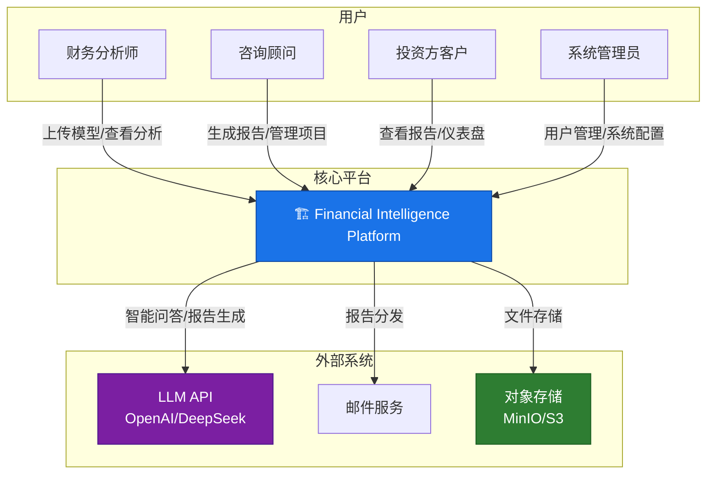
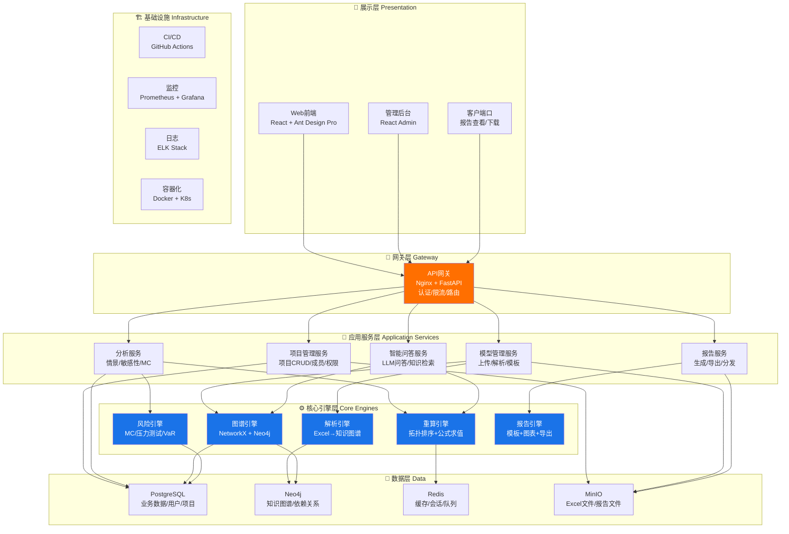
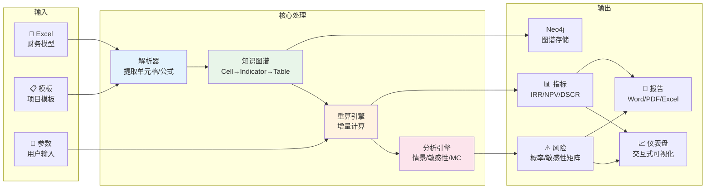
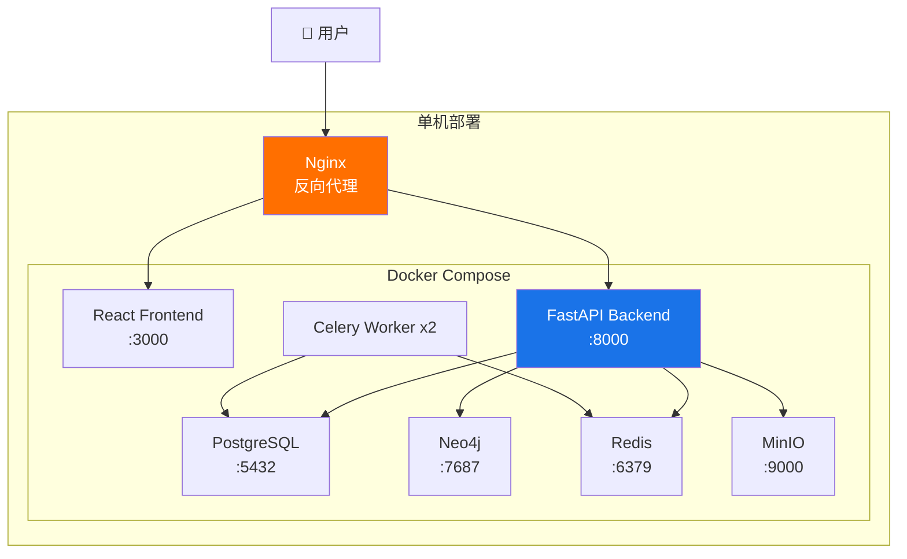

# Financial Intelligence Platform — 系统架构设计

> 版本: v1.0 | 日期: 2026-06-01 | 状态: 规划阶段

---

## 1. 系统愿景

从"个人财务分析工具"进化为"团队级金融智能平台"——将Excel财务模型转化为可计算、可分析、可咨询的结构化知识，为基础设施投资决策提供全链条支持。

### 1.1 核心价值链

```
Excel财务模型 → 结构化知识图谱 → 多维风险分析 → 智能投资建议 → 专业咨询报告
     ↑                ↑                ↑                ↑
   数据层           引擎层           分析层           智能层
```

### 1.2 与现有MVP的关系

现有 ~15,000 行 Python + Streamlit 代码构成核心引擎原型。新架构将：
- **保留**: 解析器、知识图谱、重算引擎、分析引擎的核心算法
- **重构**: 前后端分离、API化、数据库升级、模块解耦
- **新增**: 用户管理、模板系统、报告引擎、LLM智能层

---

## 2. 系统架构总览

### 2.1 系统上下文图 (C4 Level 1)



### 2.2 系统分层架构图



### 2.3 数据流图



---

## 3. 模块详细设计

### 3.1 模块全景图

| 模块 | 当前状态 | 目标状态 | 复杂度 |
|------|---------|---------|--------|
| **Excel解析器** | ✅ 已实现(pumped-storage专用) | 🔧 泛化为通用解析器 | ⭐⭐⭐ |
| **知识图谱引擎** | ✅ 已实现(NetworkX+Neo4j) | 🔧 API化+多项目隔离 | ⭐⭐⭐ |
| **重算引擎** | ✅ 已实现(增量+快速路径) | ✅ 基本可用，微调接口 | ⭐⭐⭐⭐ |
| **情景分析** | ✅ 已实现 | 🔧 参数化+并行优化 | ⭐⭐ |
| **敏感性分析** | ✅ 已实现 | 🔧 矩阵扩展+可视化增强 | ⭐⭐ |
| **蒙特卡罗** | ✅ 已实现(并行模式) | 🔧 分布类型扩展 | ⭐⭐ |
| **报告生成** | ✅ 已实现(Word) | 🔧 多格式+模板系统 | ⭐⭐⭐ |
| **智能问答** | ✅ 已实现(基础Q&A) | 🔧 RAG增强+多轮对话 | ⭐⭐⭐ |
| **用户管理** | ❌ 未实现 | 🆕 RBAC+多租户 | ⭐⭐ |
| **模板系统** | ❌ 未实现 | 🆕 多行业模型模板 | ⭐⭐⭐ |
| **前端应用** | ⚠️ Streamlit原型 | 🆕 React专业前端 | ⭐⭐⭐⭐ |
| **API层** | ❌ 未实现 | 🆕 RESTful API | ⭐⭐⭐ |

### 3.2 核心引擎层详细设计

#### 3.2.1 解析引擎 (Parser Engine)

**职责**: 将Excel财务模型转化为结构化知识图谱

```
┌─────────────────────────────────────────────────┐
│                 Parser Engine                     │
├─────────────────────────────────────────────────┤
│  excel_reader.py      双模式读取(公式+缓存值)    │
│  formula_parser.py    公式词法分析器             │
│  reference_resolver.py 引用解析(跨表/跨区域)     │
│  cell_extractor.py    单元格层DiGraph构建        │
│  table_detector.py    规则驱动的表头识别         │
│  indicator_builder.py 指标层构建(行级聚合)       │
│  template_engine.py   [新增] 模板驱动的结构识别  │
│  model_validator.py   [新增] 模型结构校验        │
└─────────────────────────────────────────────────┘
```

**关键设计决策**:
- Cell ID格式: `{sheet}_{row}_{col}`，用 `rsplit("_", 2)` 解析
- 边方向: `add_edge(from, to)` = from **依赖** to
- 模板系统: 通过JSON schema定义表结构映射规则，支持不同行业模型

#### 3.2.2 图谱引擎 (Graph Engine)

**职责**: 管理三层知识图谱的构建、存储、查询

```
┌─────────────────────────────────────────────────┐
│                 Graph Engine                      │
├─────────────────────────────────────────────────┤
│  graph.py             FinancialGraph容器         │
│  graph_builder.py     图谱构建协调器             │
│  graph_query.py       [新增] 图谱查询服务        │
│  dependency_tracker.py 依赖追踪和BFS             │
│  neo4j_sync.py        Neo4j双向同步              │
│  graph_cache.py       [新增] 图谱缓存管理        │
└─────────────────────────────────────────────────┘
```

**三层图谱模型**:
```
Layer 1: Cell层    — 58K节点，公式依赖边
Layer 2: Indicator层 — 2968指标，行级聚合
Layer 3: Table层   — 49表，结构化分组
```

#### 3.2.3 重算引擎 (Recalc Engine)

**职责**: 增量重算，修改参数后自动传播到所有受影响单元格

```
┌─────────────────────────────────────────────────┐
│                 Recalc Engine                     │
├─────────────────────────────────────────────────┤
│  dependency.py        Kahn拓扑排序               │
│  evaluator.py         formulas库桥接             │
│  recalculator.py      增量重算主流程             │
│  fast_path.py         快速路径(IF/SUMIF/EDATE)   │
│  snapshot.py          快照创建/比对/恢复         │
│  workspace.py         场景参数工作空间           │
└─────────────────────────────────────────────────┘
```

**性能目标**:
- 全量重算: < 15分钟 (当前 ~7-15分钟)
- 增量重算: < 30秒 (单参数修改)
- 快速路径命中率: > 40% (IF/SUMIF/EDATE/COUNTIF)

#### 3.2.4 风险引擎 (Risk Engine)

**职责**: 多维度风险分析和量化

```
┌─────────────────────────────────────────────────┐
│                 Risk Engine                       │
├─────────────────────────────────────────────────┤
│  scenario_analysis.py   悲观/基准/乐观情景       │
│  sensitivity.py         参数敏感性分析           │
│  monte_carlo.py         蒙特卡罗模拟             │
│  break_even.py          盈亏平衡分析             │
│  stress_test.py         [新增] 压力测试框架      │
│  risk_metrics.py        [新增] VaR/CVaR计算      │
│  derived_metrics.py     IRR/NPV/DSCR/回收期      │
└─────────────────────────────────────────────────┘
```

#### 3.2.5 报告引擎 (Report Engine)

**职责**: 多格式报告生成和分发

```
┌─────────────────────────────────────────────────┐
│                 Report Engine                     │
├─────────────────────────────────────────────────┤
│  template_manager.py   [新增] 报告模板管理       │
│  chart_generator.py    [新增] 图表自动生成       │
│  report_builder.py     报告组装流水线            │
│  exporters/                                 │
│    ├─ word_export.py   Word报告导出              │
│    ├─ pdf_export.py    [新增] PDF导出            │
│    ├─ excel_export.py  Excel导出(已实现)         │
│    └─ ppt_export.py    [新增] PPT演示文稿导出    │
│  narrative_gen.py      [新增] LLM驱动文字叙述    │
└─────────────────────────────────────────────────┘
```

### 3.3 API设计概要

```
/api/v1/
├── /auth/                    # 认证
│   ├── POST /login           # 登录
│   ├── POST /refresh         # Token刷新
│   └── POST /logout          # 登出
│
├── /projects/                # 项目管理
│   ├── GET /                 # 项目列表
│   ├── POST /                # 创建项目
│   ├── GET /{id}             # 项目详情
│   ├── PUT /{id}             # 更新项目
│   └── DELETE /{id}          # 删除项目
│
├── /models/                  # 模型管理
│   ├── POST /upload          # 上传Excel
│   ├── POST /parse           # 触发解析
│   ├── GET /{id}/status      # 解析状态
│   ├── GET /{id}/graph       # 获取知识图谱
│   └── GET /{id}/sheets      # 获取工作表列表
│
├── /recalc/                  # 重算
│   ├── POST /{model_id}      # 执行重算
│   ├── GET /snapshots        # 快照列表
│   ├── POST /snapshots       # 创建快照
│   └── GET /diff/{a}/{b}     # 快照对比
│
├── /analysis/                # 分析
│   ├── POST /scenario        # 情景分析
│   ├── POST /sensitivity     # 敏感性分析
│   ├── POST /monte-carlo     # 蒙特卡罗
│   ├── POST /break-even      # 盈亏平衡
│   └── GET /history          # 分析历史
│
├── /reports/                 # 报告
│   ├── GET /templates        # 模板列表
│   ├── POST /generate        # 生成报告
│   ├── GET /{id}             # 报告详情
│   └── GET /{id}/download    # 下载报告
│
└── /qa/                      # 智能问答
    ├── POST /ask             # 提问
    ├── GET /history          # 问答历史
    └── POST /batch           # 批量问答
```

---

## 4. 技术选型

### 4.1 核心技术栈

| 层级 | 技术 | 选型理由 |
|------|------|---------|
| **前端** | React 18 + Ant Design Pro + ECharts | 企业级UI组件，图表能力强 |
| **后端** | Python 3.11+ + FastAPI | 异步高性能，与现有Python引擎无缝对接 |
| **图数据库** | Neo4j 5.x Community | 成熟的图数据库，已有集成经验 |
| **关系数据库** | PostgreSQL 15 | 生产级RDBMS，JSON支持好 |
| **缓存** | Redis 7 | 会话管理、计算缓存、任务队列 |
| **对象存储** | MinIO | S3兼容，可自托管，适合私有部署 |
| **任务队列** | Celery + Redis | 异步任务(解析、重算、MC模拟) |
| **容器** | Docker + Docker Compose | 一键部署，开发环境一致性 |
| **CI/CD** | GitHub Actions | 自动化测试、构建、部署 |
| **监控** | Prometheus + Grafana | 系统指标、性能监控、告警 |

### 4.2 从MVP迁移的技术决策

| 当前(MVP) | 目标(生产) | 迁移策略 |
|-----------|-----------|---------|
| Streamlit | React + Ant Design Pro | 前端完全重写，后端API化 |
| 直接函数调用 | RESTful API (FastAPI) | 逐步封装现有函数为API端点 |
| SQLite | PostgreSQL | 数据模型不变，切换驱动 |
| 本地文件系统 | MinIO | 文件上传/下载接口统一 |
| 单进程 | Celery Worker | 重算/MC等长任务异步化 |
| 无认证 | JWT + RBAC | 新增认证中间件 |
| 单项目 | 多项目多租户 | 项目ID隔离 |

### 4.3 开发环境

```yaml
# docker-compose.dev.yml
services:
  frontend:
    build: ./frontend
    ports: ["3000:3000"]
    volumes: ["./frontend/src:/app/src"]

  backend:
    build: ./backend
    ports: ["8000:8000"]
    volumes: ["./backend:/app"]
    depends_on: [postgres, neo4j, redis, minio]

  postgres:
    image: postgres:15
    environment:
      POSTGRES_DB: financial_platform
      POSTGRES_USER: dev
      POSTGRES_PASSWORD: dev_password

  neo4j:
    image: neo4j:5
    ports: ["7474:7474", "7687:7687"]
    environment:
      NEO4J_AUTH: neo4j/dev_password

  redis:
    image: redis:7-alpine
    ports: ["6379:6379"]

  minio:
    image: minio/minio
    ports: ["9000:9000", "9001:9001"]
    command: server /data --console-address ":9001"
```

---

## 5. 非功能性需求

### 5.1 性能指标

| 场景 | 目标 |
|------|------|
| Excel上传解析 (58K cells) | < 60秒 |
| 全量重算 | < 15分钟 |
| 增量重算 (单参数) | < 30秒 |
| 情景分析 (3情景) | < 2分钟 |
| 蒙特卡罗 (1000次) | < 60秒 (并行) |
| 敏感性分析 (10参数) | < 5分钟 |
| 报告生成 | < 30秒 |
| API响应时间 (P95) | < 500ms |
| 页面加载 | < 2秒 |

### 5.2 安全要求

- JWT认证 + RBAC权限控制
- 所有敏感数据加密存储
- API接口限流防滥用
- 操作审计日志
- SQL注入/XSS防护
- 定期安全扫描

### 5.3 可扩展性

- 支持多种行业模型模板（水电/光伏/风电/公路/桥梁/房地产）
- 插件式分析模块（新分析方法可独立开发接入）
- 水平扩展：无状态的API层可水平扩展，有状态的重算引擎通过任务队列调度

---

## 6. 部署架构

### 6.1 初期部署方案 (单机)



### 6.2 扩展部署方案 (集群)

当用户量增长后，可升级为Kubernetes集群部署：
- API层: Horizontal Pod Autoscaler (根据CPU/请求量自动伸缩)
- Worker层: 根据任务队列深度自动伸缩
- 数据库: PostgreSQL主从复制，Neo4j集群
- 存储: MinIO分布式模式

---

*文档结束。详细的开发路线图见 [project-roadmap.md](./project-roadmap.md)*
